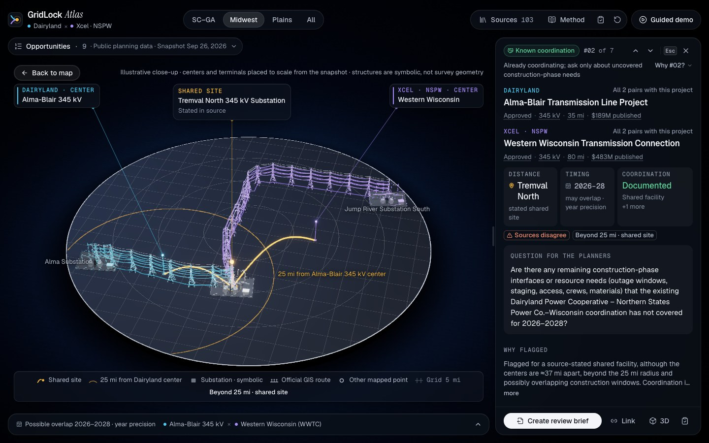
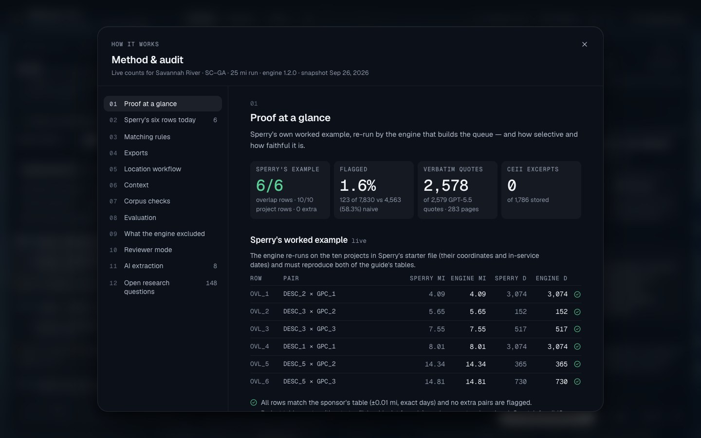

# GridLock Atlas

**Compare public utility construction plans. Flag where they meet in place or time. Show the evidence.**

GridLock Atlas is our ShellHacks 2026 entry for the **Sperry Tech GridLock Challenge**. It ingests the public future-construction plans of neighboring power utilities, finds project pairs that sit within 25 miles of each other (the sponsor's primary signal), weighs their timing (the secondary signal), and ranks the coordination opportunities. Every fact on screen links to a short verbatim excerpt from a public document, with its page.

> A match is a **review lead**, not a finding that crews or equipment can be shared. Absence of a coordination statement is shown as *unknown*, never as "uncoordinated."

**At a glance** (snapshot of 26 September 2026, engine 1.2.0):

- **Sperry's rule, literally.** Of 7,830 DESC × Georgia Power project pairs, 111 have centers under 25 miles; they are exactly the rows of the sponsor-format overlap table. Across all regions the engine flags 133 of 7,929 candidate pairs (1.7%); a "close *or* same time" rule would flag 4,622 (58.3%).
- **Both signals, stated honestly.** 9 of the top 12 Savannah River leads have a confirmed place and overlapping published schedules, including Sperry's own OVL_3 pair (#2, 18 months of overlap); the app always says field-work dates are not published.
- **Sperry's worked example reproduced exactly** (6/6 overlap rows, 10/10 project rows, no extra pairs), then replayed on today's plans.
- **Every fact cited:** 1,786 verbatim excerpts from 103 public sources, each re-found in its cached source by script. GPT-5.5 re-read all 283 plan pages as a cross-check: 2,578 of 2,579 of its quotes are verbatim.


| Where plans meet (Savannah River) | Known coordination (Wisconsin) |
| --- | --- |
|  |  |
| **Cited review brief** | **Rough impact estimate** |
|  |  |
| **3D close-up (presentation only)** | **Method & audit** |
|  |  |

Screenshots are 1440×900, regenerated from the running app by `node scripts/visual/shoot.mjs`.

## What's in the box

| | |
| --- | --- |
| **3D map** (Mapbox GL, full-bleed) | Both utilities' planned projects as dots in their utility colors, with procedural 3D structures (spires at region zoom; substations, towers and pylons closer in; height by published voltage class, symbolic). After a comparison: amber arcs for flagged pairs, rank chips on the top three, hotspot rings with pair counts. Routes only where a source maps them (towers and wires only along official GIS routes; dashed = schematic); locality halos for approximate places; a 25-mile ring around one center of the selected pair. **3D** or **Flat map** (the accurate overhead reading); **Night**, **Satellite** or **Offline** basemap, with an automatic fallback to bundled Census boundaries; a **Map key** |
| **Opportunities panel** (the ranked list) | Headline in Sperry's terms ("111 within Sperry's 25 miles · of 7,830 pairs checked · 123 pairs flagged"); the ✓ proof chip; the **Review radius** slider (Sperry's rule marked at 25 mi); tabs **Needs review · Known · Possible**; timing chips (**Schedules overlap**, **May overlap**, **Timing unknown**, **No overlap**), **Dates revised or disputed** and a **Utility** filter; two-line rows with owners and plain-word facts ("≈6.7 mi apart", "may overlap 2028") and chips (*Sperry OVL_n*, *Sources disagree*, *Date passed*, *Beyond 25 mi · shared site*); an explainable order (place first, then timing, then evidence completeness). The **Export** menu downloads both of the sponsor's tables as CSV: the **overlap table** (only pairs whose centers are under 25 mi, closest first, numbered OVL_1… as in the starter file) and the **project table** (the two points behind each center, the center, in-service date, `overlap_count`, `overlap_1…n`), each with our columns after the sponsor's (unique ids, priority and per-tab queue rank, the review radius, the weakest location behind a center, whether an in-service gap is exact or a lower bound); plus **All flagged pairs**, the open pair's brief and reviewer exports. UTF-8 with BOM, so Excel shows names correctly |
| **Pair card** (evidence inspector) | A verdict line (status, "#01 of 95", what to do next), both titles owner first, three tiles (**Distance**, **Timing**, **Coordination**), the **Question for the planners**, why the pair is flagged, and *Why #01?* (the reasons behind the rank and its priority, "an explainable ordering, not a probability"). Section buttons open the evidence: **Where they meet** (center-to-center distance with uncertainty, terminals and their geocode provenance), **When they build** (windows by source, in-service gap), **Coordination on record**, **Rough impact estimate** (each channel cited and labeled stated, conditional or context, never summed), **Sources disagree** (both sides kept) and the public sources. Footer: **Create review brief**, **Link**, **3D close-up** (shown as "3D" at the default card width) and **Label this pair** (the clipboard icon). **Pair above / Pair below** (the arrows beside the rank) step through the list |
| **3D close-up** | The selected pair on a plinth: centers and terminals placed to scale from the snapshot, symbolic structures, towers and wires only along official GIS routes (a dashed "route not published" chord otherwise), the shared site's beacon, Sperry's 25-mile ring and a ruler such as "≈6.7 mi of 25 mi". Drag to orbit; `Esc` or **Back to map** returns. Presentation only; the caption says so |
| **Timeline dock** | Before a pair is open: *Planned in-service years*, one tick per project, flagged pairs bright. With a pair: published windows per source with fuzzy edges for coarse dates, completion claims, and the shared window or in-service gap. Collapsible |
| **Cited review brief** | One planner-ready question with numbered citations; copy as Markdown, download, or print to PDF |
| **Method & audit** | Opens on **Proof at a glance** (Sperry's worked example re-run live: 6/6 overlap rows, 10/10 project rows, 0 extra pairs; the flag rate against a naive rule; the GPT-5.5 quote check; 0 CEII excerpts), then **Sperry's six rows today**, matching rules with live counts for Sperry's 25-mile rule, the three exports (the third lists every flagged pair with `sponsor_rule` and `beyond_rule_reason`), the guide's three-step location workflow with our counts and a one-name-one-location audit, cited context (FERC Order 1920, SCRTP → SERTP, the newest-source check, CEII), live corpus checks, the **evaluation** (baselines, negative controls, extraction agreement, from `npm run eval`), exclusions, reviewer mode and its exports, extraction runs, open research questions |
| **Source registry** | 103 cited public documents and 1,786 short excerpts, 100% located verbatim; each document with its publisher, retrieval date, SHA-256 and excerpt count, grouped by kind of publisher, with a filter |
| **Reviewer mode** | The top bar's reviewer toggle (or **Label this pair**): label pairs (worth review / already coordinated / not useful / insufficient evidence) with a review timer; mark excerpts human-checked; export labels as CSV and `review-log.json` from the Export menu or Method & audit |
| **Guided demo** | Eight-step walkthrough of the three-minute story, one key number per step; the last step's **Sperry's worked example ✓ 6/6** opens Method & audit |
| **Resizable panels** | Drag the edge of the Opportunities panel, the pair card or the timeline dock (or focus it and use the arrow keys; double-click, Home or Enter resets). Sizes are remembered in the browser |
| **Keyboard and phone** | `C` compares, `J`/`K` step through the list, `H` hides the panels, `Esc` closes the top layer. On a phone the list is a bottom sheet with three heights, the pair card opens as its own sheet, and Sources, Method & audit and reviewer mode sit in the **More options** menu |

## Design

The map is the stage: it fills the window, and the interface floats over it as a few frosted panels (the Opportunities panel, the pair card, the timeline dock) placed by one layout function (`lib/layout.ts`), which also frames the camera in the space they leave. The 3D structures are original low-poly models generated in code (`lib/models/structures.ts`, exported to `public/models/*.glb` by `scripts/build-models.ts`). They are symbolic: a structure stands only at a named facility or a project center, its height encodes the published voltage class, and towers appear only along official GIS routes. The 3D pair close-up (React Three Fiber) places the pair's centers and terminals to scale on a plinth. 3D is presentation only; **Flat map** is the accurate overhead reading, and every number is the same in both. Panels are resizable. One amber accent is kept for flagged pairs and overlaps, and a utility's color always comes with its name. With reduced motion the camera jumps instead of flying.

## Data

Snapshot date **26 September 2026**. All sources are public; each is fetched, hashed (SHA-256) and cached, and the app only reads the frozen snapshot (`data/snapshot.json`), so the demo works if publisher sites or APIs are down.

**Region B — Savannah River (SC–GA), the sponsor's example pair**

- Dominion Energy South Carolina: SCRTP *Planned Transmission Projects $2M and above*, 2026–2030 (current), with the 2025–2029 and 2024–2028 editions kept as version history. Parsed deterministically, one project per page, with project ID, status, planned in-service date, yearly budget and scope.
- Georgia Power: 2025 IRP Technical Appendix Vol. 3 — the 2024 GA ITS Ten-Year Plan (public disclosure, Georgia PSC Docket 56002). Parsed from the summary table (zone, TEAMS number, sponsor) and each project page (Start Date, Need Date, scope, miles). GPC and Savannah-area (SAV) projects are included; GTC, MEAG and Dalton projects in the joint plan are out of scope.
- SERTP's 2025 regional plan (November 2025) and 2026 Preliminary Expansion Plan (June 12, 2026). Where SERTP gives a newer in-service year than the Ten-Year Plan, the newer year is current and older dates are kept as version history; where SERTP 2026 only repeats the Need Date's year, the more precise Need Date stays current (a generator check fails if a Savannah-area SERTP year is left unreconciled). SERTP 2026 adds five Savannah-area projects at McIntosh, West McIntosh and Meldrim. It files them under "SOCO" without naming the owner, so Georgia Power is labeled an inference. Where sources disagree (the conductor of the Goshen–McIntosh rebuild; whether Georgia Power's 21116 line is MEAG's), both sides are kept with their excerpts.
- Georgia Power project pages (Effingham County 500 kV, Callaway Road–Thomson 500 kV), and a Georgia EPD stormwater Notice of Intent for "Big Ogeechee to Little Ogeechee" (permit window 01/19/2026 → 06/30/2027, labeled permit-coverage dates, not a crew schedule; linking it to TEAMS 19966 is labeled an inference).
- DESC's Jasper–Okatie 230 kV #2 siting docket (SC PSC Docket 2023-115-E): commercial operation "December 1, 2026" (letter of March 7, 2025, p. 2), right-of-way widths (application pp. 2–3), and the construction estimate revised "from approximately $54 million to approximately $98 million" (letter, p. 2). Dominion's project page dates the start of construction (Q1 2025, "Anticipated – Subject to Change"); the same PSC letter says a Coastal Zone certification was still pending, so the app notes the start may have slipped.
- Terminals are geocoded against OpenStreetMap power features (Overpass) and Nominatim, then checked against each plan's own wording; unconfirmed matches are marked lower-confidence and cost ranking points.
- **Newest-source check** (the challenge asks for one). On 26 September 2026 the SCRTP home page linked one planned-facilities list, the 2026–2030 edition, so it is our current DESC source. DESC and Santee Cooper "are planning to join" SERTP, effective with DESC's Order 1920 compliance filing (SCRTP home page). A text search of SERTP's two June 2026 preliminary-plan documents (the 115-page report and the 174-page meeting presentation) finds no "Dominion"; the report names DESC only as a terminal of a Duke Energy Progress line ("SUMTER - DESC EASTOVER", p. 17). SERTP's September 2026 meeting still lists SCRTP as a neighboring region (p. 43). Our reading, stated as such in the app: SERTP has not taken over DESC's list yet.
- **CEII.** Only public editions are used. SERTP's regional plan is its non-CEII edition (p. 3). The Georgia Power file is the public-disclosure version from Georgia PSC Docket 56002. Its pages still carry a CEII banner, fields marked REDACTED stay redacted, and we store only short excerpts. A live check in Method & audit (*Proof at a glance*) counts stored excerpts that quote CEII-marked text: 0.
- The challenge packet's two plan PDFs (DESC 2024–2028 list, Georgia Power 2025 IRP Vol. 3) are byte-identical (SHA-256) to our cached copies.
- Context: FERC Order No. 1920 (Federal Register, 89 FR 49280): effective August 12, 2024 (p. 1). Each transmission provider must include in its in-kind replacement estimates the facilities it owns at or above 200 kV, or a lower proposed threshold, that it expects to replace (p. 258).

**Region A — Upper Midwest and Southern Plains** (featured *Known coordination* cases)

- Dairyland Alma–Blair 345 kV and Xcel/NSPW Western Wisconsin Transmission Connection: the Wisconsin PSC decision states Dairyland's line terminates at Tremval North, the substation approved for Xcel's project.
- Grid Forward Central Wisconsin (ATC and NSPW segments), MISO BECI, MN LRTP projects, and Potter–Beckham (Xcel/SPS Texas and Transource Oklahoma segments), plus completed projects as negative controls.

Research was agent-assisted: AI research agents located facts and exact quotes, adversarial fact-checking agents re-verified them, and **every excerpt is re-located verbatim by script** when the snapshot is built (`scripts/build-snapshot.ts`) and again by the audit (`npm run audit`). Excerpts are labeled "awaiting human check" until a person marks them in reviewer mode and the exported `review-log.json` is committed.

The snapshot holds 219 projects from 19 utilities, 103 cited public sources and 1,786 excerpts, all re-found verbatim; 0 are human-checked so far.

**Model cross-check.** OpenAI GPT-5.5 (`gpt-5.5-2026-04-23`, structured outputs, frozen prompt `gridlock-extract/1.1`) independently re-read **all 283 in-scope Region B plan pages** (145 DESC, 138 Georgia Power; `npm run extract:eval`, report in [`data/eval/extraction-eval.md`](data/eval/extraction-eval.md)). 2,578 of its 2,579 quoted fields are verbatim on the page. Where it and our deterministic parser both give a value they agree on 1,642 of 1,667 (98.5%, 95% CI 97.8–99.0). Every value that disagrees with the parser, or that the parser lacks, quotes the page verbatim, and it never returned a number for Georgia Power's redacted costs. One gap is reported, not fixed mid-run: it leaves Georgia Power's "Need Date" out of the in-service field on 88 of 138 pages. These are agreement rates with our parser, not accuracy. Model output never enters the snapshot or the engine. Separately, eight runs on the pages behind the top leads are shown in Method & audit (*AI extraction*) and re-checked by the audit (67 of 68 quoted fields verbatim; the one that was not, a cost figure, is rejected). The script also supports Gemini (`--provider gemini`); it was not run for this submission.

## Method (short)

1. **Place first.** Sperry's rule, literally: a pair counts when the project centers are **under 25 mi** apart. Each center is the midpoint of the project's two named terminals (or its one located point), exactly as in the guide. Only these pairs go into the sponsor-format overlap table, closest first. Location uncertainty is kept as bounds, `d_low = max(0, d − e_A − e_B)` and `d_high = d + e_A + e_B` (confirmed when `d_high ≤ 25`, possible when only `d_low ≤ 25`). Beyond the rule we also flag three kinds of review leads, each with its reason in the "all flagged pairs" export: a source-stated (or implied) shared facility, or terminals geocoded to the same substation, whatever the line length; uncertainty that reaches inside the radius; and county-only evidence, which is at most "possible". Schematic routes are never measured.
2. **Then time.** Construction windows are compared for every source combination (confirmed when `max(S_latest) ≤ min(E_earliest)`). No window is invented from an in-service date alone: a start plus a "by"/need date is kept as bounds with the field work undated, and DESC's yearly budget gives a coarse window (a budget year under 5% of the total counts as preconstruction and never starts it; when DESC reports earlier spending only as a "Previous" total, the start year is shown as not published, e.g. "before 2026 → 2026") — both support at most a "possible" overlap. Published *schedules* are compared separately: Georgia Power's Start Date (the Ten-Year Plan's "schedule for implementation", p. 174) or DESC's first evidenced spending, to the current in-service date. When two schedules certainly overlap for at least 30 days, TIME is confirmed on a schedule basis ("Published schedules overlap (start → in-service) for N months; field-work dates are not published"), never called a construction overlap; a construction-window result that confirms or rules out overlap takes precedence. If a plan's in-service date has passed without a source confirming completion, TIME is at most "possible". A "no later than" deadline is kept as a claim but is never used as an in-service forecast. The gap between in-service dates in days — the sponsor's secondary signal — informs ranking; missing windows stay "unknown".
3. **Status.** Documented joint work or interface coordination → *Known coordination*. Otherwise within the radius (or sharing a facility stated in, or implied by, the sources) → *Needs review*; an uncertain place → *Possible*. "Needs review" means the reviewed sources are silent, never "uncoordinated". Completed (a source says so), cancelled and duplicate records are archived. A plan whose in-service date has passed without a source confirming completion stays in the queue, flagged "planned date passed; completion not confirmed" (48 projects; this keeps Sperry's OVL_2 pair visible).
4. **Rank.** Explainable points, not a probability: place (≤ 60: a stated shared facility 60, an implied one 50, otherwise 30 plus up to 30 for closeness), timing (≤ 30: construction-window overlap 30, overlapping published schedules 28–30, possible overlap 18–30 scaled by the in-service gap), evidence completeness (≤ 10); minus 5 for lower-confidence locations and 15 for a passed planned date. A pair flagged only by a shared facility while its centers are beyond the radius ranks after every within-radius needs-review pair.

The engine reproduces both tables of the sponsor's starter file exactly: the overlap table (six rows, ±0.01 mi and to the day, no extra pairs) and the project table (centers from its midpoint formula, `overlap_count`, and `overlap_1…3` in order). See `tests/engine.test.ts`, `tests/sponsor.test.ts` and Method & audit (*Proof at a glance*).

**Sperry's six rows in today's plans.** Method & audit (*Sperry's six rows today*) replays the starter file's six overlap rows on current data. Starter projects are matched to plan records by title and in-service date.

| Row | Today |
| --- | --- |
| OVL_3 (Jasper–Okatie 230 kV #2 × Goshen–McIntosh rebuild) | #2 in the Savannah River queue, 8.13 mi and ≥396 days apart on current plan dates |
| OVL_2 (Jasper–Okatie #2 × McIntosh–Purrysburg reactors) | In the queue, 4.23 mi and 183 days apart; kept although Georgia Power's planned date (June 1, 2026) has passed, because no source confirms completion |
| OVL_1, OVL_4 | DESC 6810 A and 6809 E were last listed in the 2024–2028 list (pp. 31, 14). A text search of the 2025–2029 and 2026–2030 lists finds neither Project ID. DESC's 6809 G, listed under the same corridor name (p. 15), is still listed and pairs with Georgia Power's Evans Primary–Thurmond Dam #5 rebuild in our queue |
| OVL_5, OVL_6 | DESC 6808 S (Okatie–Bluffton) was last listed in the 2025–2029 list (p. 8) and is not in the 2026–2030 list |

A project missing from a newer list is shown as "no longer listed", never as "completed": no source we reviewed says so.

**Location workflow (the guide's three steps).** (1) Find: terminal names are matched to OpenStreetMap power features and Nominatim. (2) Confirm against the plan's wording. In the Savannah River region, the points behind project centers are 252 named facilities confirmed, 27 named facilities lower-confidence and 49 town-level. Of the starter file's blank sub-points we located Hooks (lower-confidence) and Purrysburg; Ft Johnson is not located. (3) Measure: midpoint centers, haversine distance, days between in-service dates. An audit checks that each facility name resolves to one location within the engine's 0.6-mile same-site tolerance. The one exception is Goshen: the plan names two different Georgia Power substations, "Goshen (Savannah)" (p. 314) and the Goshen on the "Goshen - Vogtle corridor" (p. 382), 87 mi apart, and they are never treated as one site. The starter file itself places McIntosh at two coordinates 0.41 mi apart; our snapshot uses one point for McIntosh everywhere.

**Impact estimate (bonus).** Each flagged pair gets separate cited channels: shared new right-of-way, a shared terminal station, staging both jobs together, a shared spare transformer, outage coordination, and capital in scope. Every row shows its formula, its unit cost with a verbatim excerpt and page, its dollar year, and a label: *stated* (a source states the sharing), *conditional* (an upper bound that needs something no source shows) or *context* (scale, not a saving). Rows are never added together, because they rest on different dollar years and different conditions.

- **Top Savannah River lead:** no new corridor is needed (0 acres). Staging both jobs together is worth *up to* ≈ $100K (the smaller of MISO's 2018 mobilization costs for a new-site substation, $262,660, and a 115 kV line, $100,000; conditional, since no source shows shared crews or aligned field dates). Both lines are named for McIntosh, so if their field work overlaps their planned outages belong in one coordinated plan (NERC IRO-017-1; not priced). Capital a joint review would cover, listed and not summed: DESC's published $5.4M, and Georgia Power's redacted rebuild as a labeled mileage proxy, 6.7 mi × $1.2M–$1.7M/mi ≈ $8.1M–$11.4M.
- **Tremval North (Wisconsin):** the PSC states Dairyland's line connects to the new Tremval North station approved for Xcel's project, so one 345 kV terminal instead of two is worth ≈ $9.0M–$12.4M and 1.5–2.2 acres (stated; MISO's new 4-position ring bus minus adding 1–2 positions, MTEP24 $ with contingency and AFUDC). The separate-station alternative is our assumption, and MISO says its exploratory costs are not for planning decisions.
- **Region portfolio:** each project counted once, in its highest-ranked pair. Savannah River: 8 disjoint pairs, a staging ceiling of $857,590 (2018 $), 0 acres of new shared right-of-way. An upper-bound scenario, never a saving.

The shared-corridor calculator stays below the channels: acres one shared corridor would avoid encumbering twice (`miles × 5,280 × width ÷ 43,560`) and their value, with cited defaults (Georgia Transmission easement widths, USDA NASS 2026 land values, the MISO cost guides, and a joint proposed order in an SC PSC docket on co-building) and every input editable. The shared length defaults to the shorter published length only when both projects build new lines that do not simply meet end to end; otherwise (equipment work, or a rebuild on existing right-of-way, as in the top lead) it defaults to 0 and says so. Right-of-way width and mobilization use the pair's own voltage class where a cited table publishes it, else the nearest lower published class.

## Evaluation

`npm run eval` writes [`data/eval/eval.md`](data/eval/eval.md) and `eval.json` (about 2 s); `tests/eval.test.ts` fails if the committed report is stale. There are no human labels, so we measure what can be measured honestly and state every denominator.

| Method (7,929 candidate pairs, 25 mi) | Flagged | DESC × GPC (of 7,830) | Documented interfaces (of 13) |
| --- | --- | --- | --- |
| Same county + same in-service year | 12 | 8 | 4 |
| Centers under 25 mi only (Sperry's rule) | 111 | 111 | 0 |
| Close OR on a similar schedule | 4,622 (58.3%) | 4,563 | 13 |
| Under 25 mi AND a similar schedule | 50 | 50 | 0 |
| Same facility name in both plans | 24 | 15 | 8 |
| **GridLock engine** | **133 (1.7%)** | **123** | **10 (physical links 9/9)** |

- **Sperry's worked example** is reproduced exactly: 6/6 overlap rows (±0.01 mi, to the day) with 0 extra pairs at every radius up to 50 mi, and 10/10 project-table rows.
- **Why not a county join:** the Savannah River is the state line. Only 23 of the 111 DESC × Georgia Power pairs under 25 mi share a county; in 90 the DESC project lies entirely in South Carolina counties.
- **Nothing inside the rule is dropped:** at every radius from 5 to 100 mi, every pair whose centers are within the radius is in the queue. At 25 mi the engine adds 22 leads beyond the rule (10 shared facilities, 6 county-level, 6 where location uncertainty reaches inside the radius), each with its reason.
- **Documented interfaces, stated as circular:** the 13 links between two utilities' projects that the filings state or imply (none in the Savannah River region) have centers 25.8–122 mi apart, so the center rule alone keeps 0. We keep 10 because the engine reads the same filings' shared-facility statements; without that rule it keeps 0 (ablation A3b). A design check, not accuracy, and no precision is claimed.
- **Negative controls:** 0 flagged pairs involve a project a source calls complete (14 such pairs); 0 of the 28 flagged past-due pairs get TIME confirmed or a BOTH badge; 0 pairs over 50 mi are flagged without a shared facility; 0 pairs across regions.
- **Robustness:** the top lead is #1 at every radius from 15 to 100 mi (#2 at 10 mi, where a 4.2-mi McIntosh pair outranks it; out at 5 mi, being 6.7 mi apart). Ablations run on snapshot copies: the schedule basis supplies all 26 BOTH badges; keeping past-due plans restores 28 pairs, including OVL_2; location uncertainty adds 8 leads and keeps 3 pairs from being overclaimed.
- **Extraction:** GPT-5.5 on 283 pages, 2,578/2,579 quotes verbatim, 98.5% agreement with the parser (see *Model cross-check* above).

## Run it

```bash
npm install
cp .env.example .env.local   # add NEXT_PUBLIC_MAPBOX_TOKEN (a public pk. token)
npm run dev                  # http://localhost:3000
```

Checks:

```bash
npm run check        # type-check, lint, unit tests, data audit
npm test             # unit tests, incl. exact reproductions of the sponsor's overlap and project tables
npm run audit        # every fact has evidence; every excerpt re-found verbatim in its cached source
npm run eval         # baselines, negative controls, radius sweep, ablations → data/eval/eval.{json,md}
npm run extract:eval -- score   # re-score the 283 stored GPT-5.5 runs (no API call) → data/eval/extraction-eval.{json,md}
npm run test:ui      # 46 Playwright UI tests in Chrome (starts the dev server if needed)
```

What the UI tests cover (`tests/ui/smoke.spec.ts`, `interactions.spec.ts`, `revamp.spec.ts`): comparing plans; the featured pair agreeing across list, map, timeline dock and pair card; every evidence link being a public URL; the pair API returning every excerpt its projects cite; brief export, copy and print (only the brief, as many pages as it needs); keyboard paths (Escape from inside inputs, no shortcuts behind the brief or Method & audit, a presenter's Space and Tab path through the demo); reduced motion; the offline fallback with all Mapbox requests blocked; the Export menu (whole-region scope, both sponsor-format CSVs with only pairs under 25 mi, closest first, OVL_n in order, every overlap row referenced by both of its projects; the brief item needs an open pair); the ✓ proof chip opening Method & audit on *Proof at a glance* and a *Sperry OVL_n* chip opening *Sperry's six rows today*; the headline counting a region's flagged pairs once; the review-radius slider (a slow reply never overwrites a newer radius; a deep link with `&r=`); timing chips, the dates-revised-or-disputed chip, the Utility filter and every empty state; rows in plain words; the pair card's verdict line and *Pair above / Pair below*; *All N pairs with this project* focusing the list without renumbering it; an engine failure being reported rather than silently dropping back to the start screen; reviewer mode, notes and exports; basemap, 3D / Flat map (Flat hides the whole 3D scene) and region switching; the 3D close-up opening over the map and closing with Esc or *Back to map*; resizing panels by drag and keyboard, reset and persistence; deep links and Copy link; all eight guided-demo steps (narration matches the screen, controls stay clear of the pair card and the brief); and phone and laptop viewports (camera, bottom sheet, the More options menu, tapping a project dot, no horizontal scroll).

Visual checks against a running dev server (the app's URL comes from `BASE`, or `PORT` on localhost, default `http://localhost:3218`):

```bash
node scripts/visual/shoot.mjs                 # regenerate docs/screenshots/*.jpg at 1440×900
SHOTS=demo node scripts/visual/shoot.mjs /tmp/shots   # the eight guided-demo steps, for review (also: prerun, sources)
node scripts/visual/sizes.mjs /tmp/shots      # pair #02 at 1024×768 to 1920×1080 (incl. 1280×720), with a horizontal-overflow check
node scripts/visual/basemaps.mjs /tmp/shots   # Satellite, Offline, Night, Flat map and 3D on the Wisconsin pair
```

The app also went through several rounds of adversarial review: engine correctness, honesty of claims, UI and accessibility, the data pipeline, phone and tablet layouts, the guided-demo narrative, and the exported brief and CSV. Each finding was independently re-verified before it was fixed. About 120 verified issues were fixed, most with regression tests.

Rebuilding data (optional — the snapshot is committed):

```bash
npm run sources:fetch -- --local gpc-irp-2025-vol3="path/to/2025 IRP Volume 3 PUBLIC DISCLOSURE.pdf"
python3 scripts/ingest/parse_region_b.py
npm run snapshot:build
npm run extract -- desc-scrtp-2026-2030 --page 41    # optional model extraction (OPENAI_API_KEY in .env.local)
```

API: `GET /api/snapshot`, `GET /api/matches?threshold=25&utilityA=&utilityB=&region=&year=`, `GET /api/matches/:id`.

## Demo (three minutes)

The full timed script, with a 30-second fallback, is in [`docs/pitch.md`](docs/pitch.md); likely judge questions are answered in [`docs/judge-qa.md`](docs/judge-qa.md). Press **Guided demo** in the top bar to run these beats; `→` or **Next** advances.

1. **Two utilities, two separate plans** — the SC–GA (Savannah River) region: DESC in cyan, Georgia Power in violet, 199 projects.
2. **Compare public plans** — 7,830 DESC × Georgia Power pairs measured. The Opportunities panel headline reads **111** within Sperry's 25 miles (95 of them confirmed, 16 possible because a location is approximate); those 111 are the sponsor-format overlap table. 12 more are flagged as possible leads on uncertain locations, each with its reason (6 known only at county level, 6 where location uncertainty reaches inside 25 mi). Across all regions: 133 of 7,929 pairs (1.7%).
3. **The top coordination opportunity** — row #01 opens in the pair card: DESC's Okatie–McIntosh 115 kV tie (a series reactor and a new Deerfield switching station) and Georgia Power's rebuild of the Goshen–McIntosh line, which stops at Georgia Pacific (Rincon) about 1.7 mi short of McIntosh — centers 6.7 mi apart, both due in service in 2028; coordination not found in the reviewed sources, and the question for the planners. Optional: **3D close-up** on the step card, then `Esc`.
4. **When they build** — TIME is *possible* for #1: the published schedules overlap by only one day (DESC's schedule starts with its first budgeted year, 2027; Georgia Power's current in-service year is 2028). Row #02 is Sperry's own OVL_3 pair (Jasper–Okatie #2 × the same rebuild): published schedules overlap for 18 months (Jun 2025–Dec 2026), so it is BOTH, and the app says field-work dates are not published. 9 of the top 12 Savannah River leads are BOTH.
5. **A rough, sourced impact estimate** — separate cited channels, never summed: 0 acres of new corridor; staging both jobs together up to ≈ $100K; capital in scope listed as DESC's published $5.4M and a labeled proxy of ≈ $8.1M–$11.4M for Georgia Power's redacted rebuild; none of it is a saving.
6. **Known coordination is kept separate** — Upper Midwest: Dairyland × Xcel at Tremval North, filed as a known interface; one 345 kV terminal instead of two ≈ $9.0M–$12.4M (stated). Its 3D close-up shows the two official GIS routes.
7. **Sources disagree — both are kept** — Xcel's page vs the Wisconsin PSC and NSPW's own Q2 2026 filing on completion; both kept side by side.
8. **Export a cited review brief** — a planner-ready question with numbered sources.
9. **Sperry's own example** — **Sperry's worked example ✓ 6/6** on the last step opens Method & audit on *Proof at a glance*: both starter tables reproduced exactly; then *Sperry's six rows today* (OVL_3 is #02 in our queue). Download the overlap and project tables from the Opportunities panel's **Export** menu.

## Limitations

- No planner labels: no precision or effectiveness is claimed. The 13 documented interfaces used in the evaluation are few, all outside the Savannah River region, and read from the same filings as our shared-facility rule.
- Public plans are incomplete and change; costs are redacted in the Georgia Power public disclosure, so any Georgia Power cost shown is a labeled mileage proxy.
- No top Savannah River pair has published field-work dates. A confirmed TIME there is a *published-schedule* overlap (start → in-service), labeled as such; DESC's budget-year window is coarse by design.
- Five SERTP 2026 projects are filed under "SOCO" with no named owner; Georgia Power is a labeled inference.
- Most substations are geocoded from OpenStreetMap by name and checked against plan text; some are approximate or lower-confidence and are labeled so.
- Coordination that is not published cannot be seen. "Needs review" means the reviewed sources are silent.
- A project missing from a newer DESC list is "no longer listed"; that is not evidence that it was completed. A plan past its in-service date is "completion not confirmed", never "completed".
- Cost guides used by the impact estimate come partly from another region (MISO) and other dollar years, and are indicative only.
- Two utilities in the sponsor's region. Duke, Santee Cooper, GTC and MEAG plans are not ingested, and the snapshot is frozen on 26 September 2026.

## Stack

Next.js 16 · React 19 · TypeScript · Tailwind CSS 4 · Mapbox GL JS 3 · three.js and React Three Fiber (procedural models, 3D close-up) · Turf · Zustand · Motion · Vitest · Playwright · Python (source fetch, PDF parsing with poppler's `pdftotext`, geocoding helpers) · OpenAI GPT-5.5 (extraction cross-check only).

Write-ups: [`docs/paper.md`](docs/paper.md) (system and evaluation paper), [`docs/devpost.md`](docs/devpost.md) (submission text), [`docs/pitch.md`](docs/pitch.md) (timed demo script), [`docs/judge-qa.md`](docs/judge-qa.md) (likely questions).

Map data © Mapbox © OpenStreetMap contributors. County and state boundaries: US Census Bureau cartographic boundary files.
